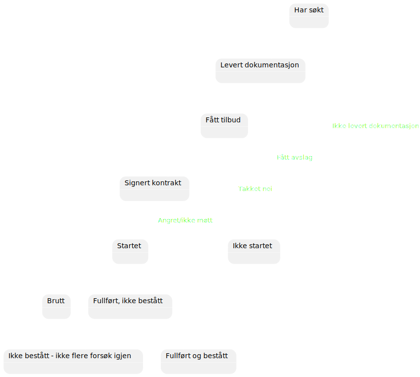

# Emne 3 - Obligatorisk oppgave

``` yaml
Innleveringsfrist: Mandag 08.01.2024 kl. 8.00
```

***

### Oppgave 1A - kode - 20 poeng

Ta utgangspunkt i [FallingParticles](FallingParticles)

Skriv dette mer objektorientert. Innfør som minimum følgende klasser:\
  - Particle
  - Paddle
  - Game

`Applikasjonen du leverer skal oppføre seg likt.`

### Oppgave 1B - tekst - 10 poeng

Gjør rede for **Single Responsibility Principle**.

Vurder om din egen kode i **oppgave 1A** tilfredsstiller dette prinsippet.

Det er ikke noe krav om at koden i 1A gjør det, men du bør kunne gjøre rede for hvordan du ev. bryter dette prinsippet.

Brukegrensesnitt og spill-logikk er to forskjellige ting, så ha med en vurdering av om du har klasser som inneholder begge disse tingene eller ikke.

En enkel måte å tenke\
Om du skulle lage en WPF-versjon av spillet, er det klasser som inneholder spill-logikk som du da ikke kunne gjenbrukt?

`Teksten på denne oppgaven skal sammen med teksten fra oppgaven 2B være på 600 ord (+/- 10%).`

### Oppgave 2A - kode 10 poeng

Figuren under viser hvilke statuser en søker/student ved GET Academy kan ha.



Lag en klasse `StudentStatus` som skal holde rede på statusen til en søker/student.

Den skal ha en metode eller property for å hente ut nåværende status.

Når man oppretter et objekt skal statusen være `Har søkt`.

Lag en metode for å bytte til en ny status som metoden får som parameter.

Byttet skal bare gjennomføres om det er lov i henhold til figuren over.

Det er bare lov om det er en pil fra eksisterende status til den nye statusen som settes.

Objekter av denne klassen skal ikke kunne endre status utenom via denne metoden.

Lag en metode til som tar en status som parameter og returnerer `true` eller `false` ut fra om objektet tidligere har hatt statusen i parameteren eller ikke.

### Oppgave 2B - tekst - 10 poeng

Forklar hva innkapsling er, hvordan man gjør det og hva som er fordelene med det.

Gjør rede for i hvilken grad koden din fra **opopgave 2A** er kapslet inn eller eventuelt hva som bryter innkapslingen

`Teksten på denne oppgaven skal sammen med teksten fra oppgavene 1B være på 600 ord (+/- 10%).`
